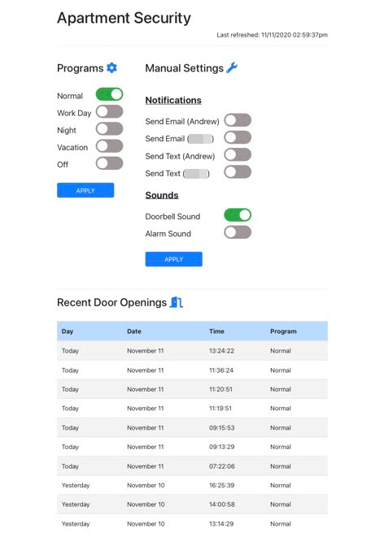

As a fun side project, I wanted to create a simple security system for our apartment. The system connected to our front door and allowed us to set different modes (normal, work day, nighttime, vacation, etc.), receive email or text notifications, play audio alerts (doorbell and alarm sounds), and log timestamps whenever the door opened. On a typical day, opening the door would trigger the doorbell sound and log the entry in the database. When we were away on vacation, I configured the "Vacation" mode to send me text alerts whenever the door opened—for example, when the pet sitter stopped by.

I repurposed a spare Raspberry Pi 3 that had been collecting dust and connected an extra speaker to it. I ordered a **[wireless magnetic contact sensor switch](https://www.jemrf.com/products/wireless-switch)** and an **[IoT gateway module](https://www.jemrf.com/products/wireless-base-station-for-raspberry-pi)** for the Pi. This project also gave me my first opportunity to solder components, which was a great learning experience.

|  |
| :--: |
| *Wireless sensor on the front door* |

I configured a LAMP stack on the Pi, along with the serial port for communication with the sensor. The user interface was a single, straightforward webpage styled using Bootstrap.

|  |
| :--: |
| *User interface* |

The core functionality lived in a Python script that ran continuously on the Pi, monitoring serial communication for any status changes from the door sensor. I used the **[Twilio API](https://www.twilio.com/docs/usage/api)** to send text messages. I've included a snippet of the Python code below.

```python
# Set up serial connection
serial_connection = serial.Serial(port='/dev/ttyS0', baudrate=9600, stopbits=serial.STOPBITS_ONE, bytesize=serial.EIGHTBITS, timeout=1)

# Main program loop; runs continuously
while (True):

    # Read in serial data
    serial_message = str(serial_connection.readline())

    # Check serial data
    if "BUTTONON" in serial_message:

        # Open database connection and cursor
        db_connection = open_database_connection(hostname, db_name, db_username, db_password)
        db_cursor = open_database_cursor(db_connection)

        # Retrieve current program and current settings
        current_program = fetch_current_program(db_cursor)
        current_settings = fetch_current_settings(db_cursor)

        # Check settings and perform appropriate actions
        if current_settings['Doorbell Sound'] == True:

            # Call function to play doorbell sound
            filename = "doorbell.mp3"
            loops = 1
            sleeptime = 5
            play_sound(filename, loops, sleeptime)

        if current_settings['Alarm Sound'] == True:

            # Call function to play doorbell sound
            filename = "alarm.mp3"
            loops = 3
            sleeptime = 21
            play_sound(filename, loops, sleeptime)

        if current_settings['Send Text (Andrew)'] == True:

            send_text(andrew_cell_number)

        if current_settings['Send Text (Wife)'] == True:

            send_text(wife_cell_number)

        if current_settings['Send Email (Andrew)'] == True:

            # Craft email
            subject = "DOOR OPENED"
            body = time.strftime("%c")
            message = "Subject: {}\n\n{}".format(subject, body)

            # Call function to send email
            send_email(message, andrew_email)

        if current_settings['Send Email (Wife)'] == True:

            # Craft email
            subject = "DOOR OPENED"
            body = time.strftime("%c")
            message = "Subject: {}\n\n{}".format(subject, body)

            # Call function to send email
            send_email(message, wife_email)

        # Write event to database
        current_timestamp = datetime.datetime.now()
        insert_door_opening(db_connection, db_cursor, current_timestamp, current_program)
        
		# Close database cursor and connection
        db_cursor.close()
        db_connection.close()
```

Even though the Raspberry Pi has long since been repurposed, I look back on this project and realize it was an excellent introduction to working with APIs and integrating hardware with software.