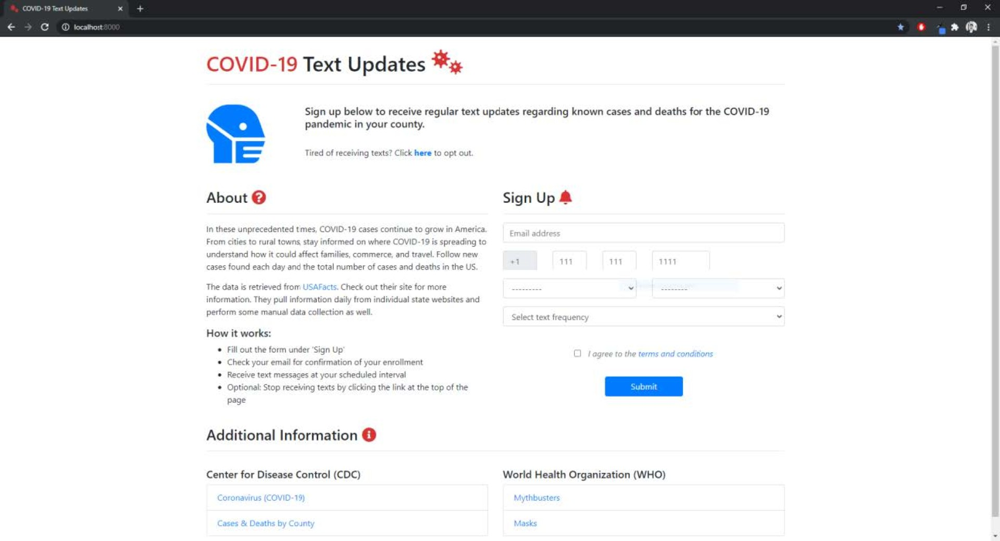
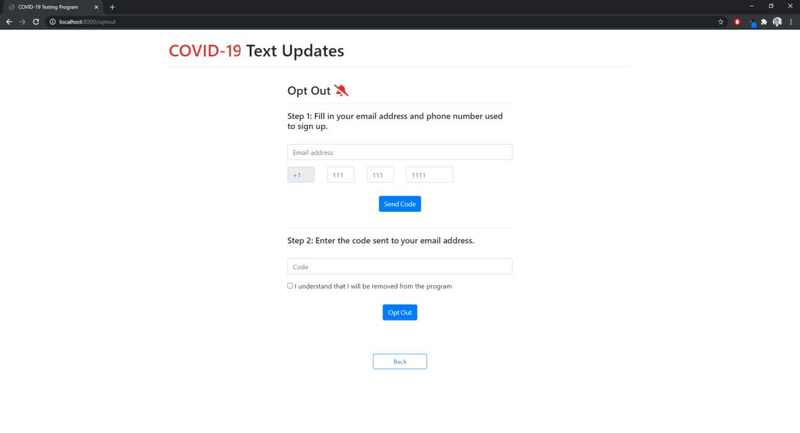
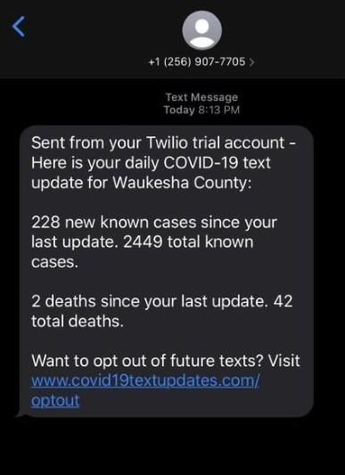

At the end of 2020, during the height of COVID-19, I was completing my graduate degree and taking a course called "Mobile Health." For the final project, we were tasked with creating a mobile health solution. I built a proof-of-concept web application that combined my interest in Django and Python development with a real-world need: delivering timely COVID-19 updates via text messages.

The application allowed users to enroll in a notification service by selecting their state and county, along with their preferred update frequency. I sourced data from **[USAFacts.org](https://usafacts.org/about-usafacts/)**, which consolidated information from state websites and routinely validated its accuracy. The goal was to keep the experience simple—minimal user interaction and minimal information required to sign up.

Screenshots of the application's main page and opt-out page are shown below:

|  |
| :--: |
| *Home page* |

|  |
| :--: |
| *Opt out page* |

A screenshot of an example text message:

|  |
| :--: |
| *Text message example* |

Orchestrating the operational processes was fairly straightforward. I created custom management commands within the Django framework to handle the core functionality. The workflow consisted of three main steps:

 - **Data retrieval and storage** - Fetch and store COVID-19 data from USAFacts
 - **Data aggregation** - Summarize data by county and update frequency for optimized processing
 - **Text distribution** - Iterate through registered users and send their personalized text updates using the **[Twilio API](https://www.twilio.com/docs/usage/api)**

This was one of the most enjoyable and rewarding projects I worked on during my graduate program. While it never went into production, I felt I had built something genuinely beneficial—especially for people without smartphones. Text messages are an accessible way to reach all mobile phone users. They require no app installations, are unobtrusive, and provide a simple, efficient way to disseminate information quickly.