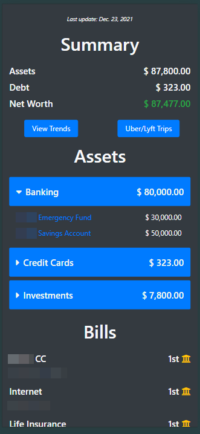
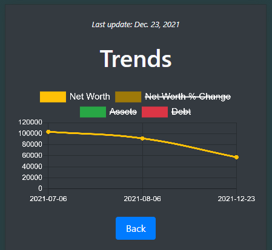
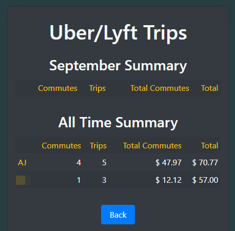

In 2021, I built a web app to consolidate our household financial data: account balances, investments, holdings, rideshare spending, and bills with their due dates. I wanted to create a shared dashboard where my wife and I could view our complete financial picture -- comparing assets to debts, tracking our investments, and monitoring trends over time. 

The concept and implementation were relatively straightforward. Each month, I would manually collect the data points and bulk import them into the database. The front end was where the most important work happened, as it needed to clearly represent the aggregated financial data. I used **[Chart.js](https://www.chartjs.org/)** for the line graphs to visualize trends over time. For security reasons, it was hosted locally on our home network.

|  |
| :--: |
| *Home page - these were test numbers/data!* |

Clicking the "View Trends" button took you to the page shown below. The screenshots only show test data — it was much more impressive with actual production data.

|  |
| :--: |
| *Trends page* |

Clicking the "Uber/Lyft Trips" button took you to the page shown below. This page allowed us to track our rideshare spending. Since we shared one car between the two of us, it was helpful to flag certain trips as commutes.

|  |
| :--: |
| *Rideshare page* |

We used the site regularly for a while, but eventually its use faded. Overall, it was a fun project that combined my personal interest in managing our finances with coding and creating a user-friendly, visually appealing interface.