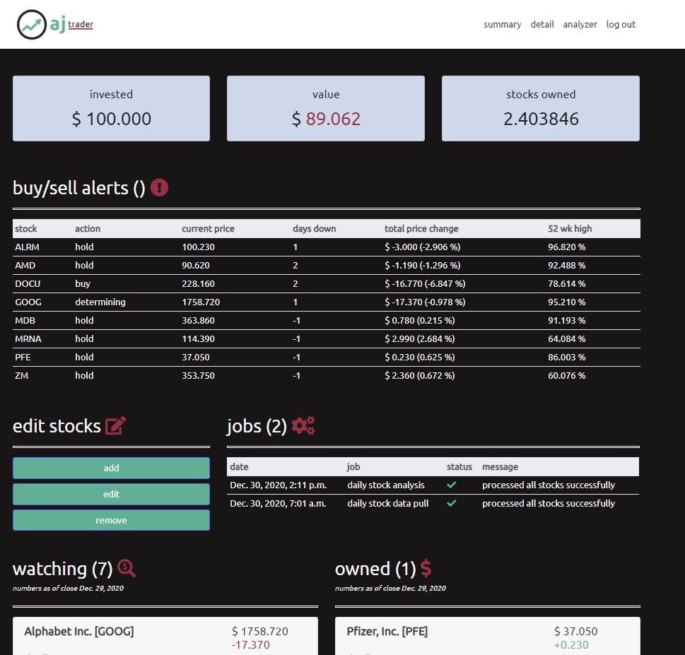
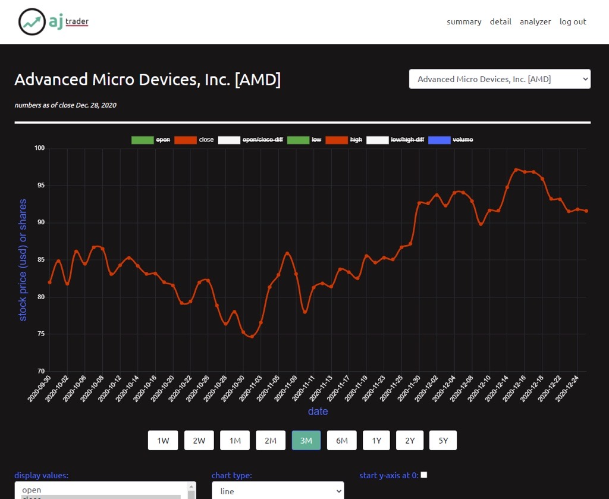

As a side project in 2020 (with ambitious dreams of striking it rich), I built a web app that functioned as a stock tracker, portfolio manager, and analyzer. Users could select stocks to monitor—whether they actually owned them or simply wanted to watch their performance. 

The application featured a dashboard that provided buy and sell alerts based on key metrics I found useful for identifying smart trades. It displayed the total value of owned stocks and offered various visualization options to examine historical trends and performance data. The goal was to consolidate the information most relevant to making informed trading decisions into a single, intuitive interface.

Screenshots of the application's main page and detail page are shown below:

|  |
| :--: |
| *Home page* |

|  |
| :--: |
| *Stock detail* |

I used the **[yfinance Python library](https://github.com/ranaroussi/yfinance)** to pull stock data each morning, which was followed by the analysis to generate buy and sell alerts. My analysis focused on metrics I personally found valuable: tracking how many consecutive days a stock trended in a particular direction, calculating the percentage of its total price change, and comparing its current price against its 52-week high. Whether these metrics were actually valuable indicators is debatable—they were simply my own preferences based on what I thought might be beneficial for making trading decisions.