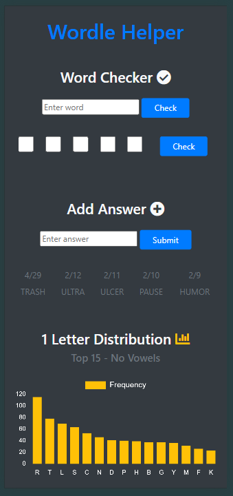
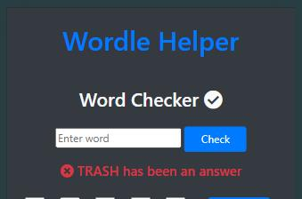

In early 2022, when **[Wordle](https://www.nytimes.com/games/wordle/index.html)** was exploding in popularity, I built a small web app to help me improve my game. Initially, I rationalized that the functionality it provided was no different than jotting information down on paper, which I'll admit was flawed logic, as it still gave me a clear advantage. Since it's all just for fun, it wasn't a big deal. The real outcome was that I went from averaging four guesses to consistently solving puzzles in three. I only used my Wordle helper for a bit, nowadays I solve it without any help!

The app consisted of a single page (screenshot below) where I could search any word to see if it had been a previous Wordle answer. I also added a pattern-matching feature—if I knew the word started with "TR", for example, I could enter those letters in the first two boxes and it would return all previous answers matching that pattern, helping me avoid guessing words that had already been answers.

In addition to the word search features, I added letter frequency distribution charts that displayed the top 15 most common letters for each position (1 through 5) based on all previous Wordle answers. For the longest time, my starter word was CRANE, because it aligned well with the highest frequency letters in each position (until it eventually became an answer itself).

|  |
| :--: |
| *Main page* |

|  |
| :--: |
| *An example of a word being checked* |

Initially, I manually added each day's answer to the database, but I eventually automated the process. I set up a cron job to run a Python script that scraped a website containing Wordle answers. Every night, it would retrieve the previous day's answer and update the database automatically.

Overall, this was just a fun little project that combined my love of coding, data analysis, and Wordle.