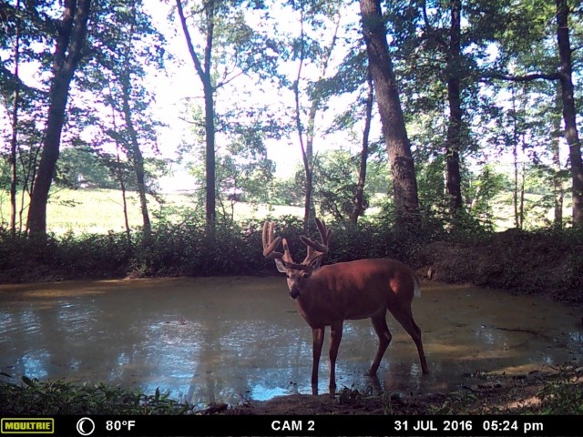

Built in 2015 as one of my early web development projects, this tool was created to help my friend analyze hunting patterns. He needed a way to upload trail camera photos and automatically retrieve the corresponding weather data for each location and timestamp. This allowed him to identify optimal hunting conditions based on historical weather patterns.

|  |
| :--: |
| *One of my friend's trailcam photos* |

To extract timestamps from the photos, I used [Exif.js](https://github.com/exif-js/exif-js), a JavaScript library for reading EXIF metadata from image files. Specifically, I accessed the DateTimeOriginal property, which captures the exact moment each photo was taken.
I then integrated the Dark Sky API to retrieve historical weather data for those timestamps. The application iterated through each uploaded photo, made API calls to fetch the corresponding weather conditions, and displayed the results on the page.

While the end result was fairly basic, the project gave me valuable hands-on experience with web development fundamentals and working with APIs.